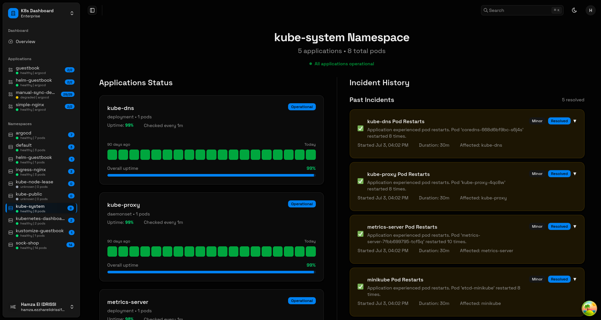
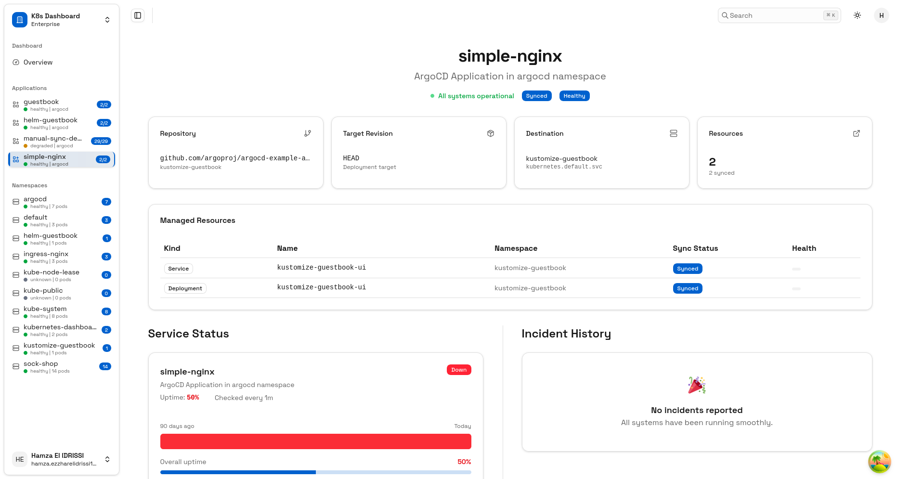
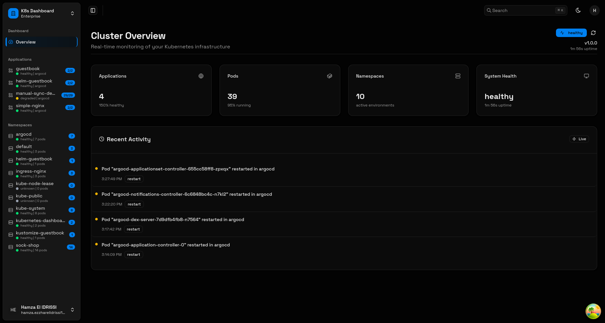

# ⚓ k8s-monitor

Transform Kubernetes data into fancy status pages. Built to make Kubernetes accessible to development teams without requiring constant ops intervention. 







## Architecture

```
Frontend (React/TS) ←→ Backend API (Go/Gin) ←→ Kubernetes API
```

## Features
- **Application-Centric View** - Monitor apps deployed with ArgoCD
- **90-Day Uptime Charts** - Visual status tracking
- **Incident Timeline** - Track application issues
- **Dynamic Sidebar** - Auto-populated with your ArgoCD applications and cluster namespaces


## Setup

I am using Makefiles to build and run the project.

```bash
make dev     # Start development servers
make build   # Build both frontend and backend
make test    # Run all tests
make docs    # Generate API documentation
make install # Install dependencies
make clean   # Clean build artifacts
```

## Environment Variables

### Frontend

```bash
NODE_ENV=development # or production
VITE_API_URL=http://localhost:8080 # or the actual API URL
```